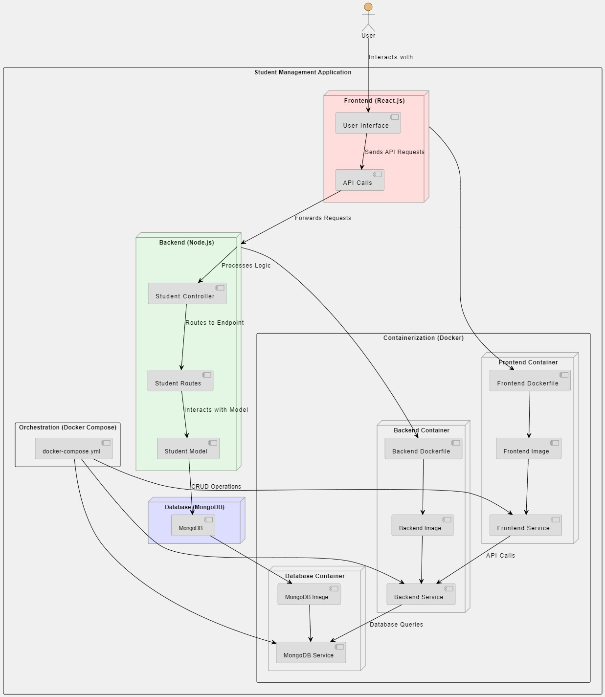
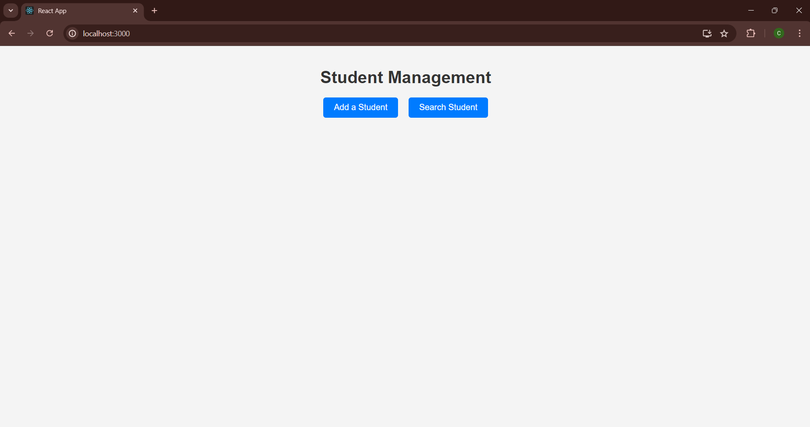
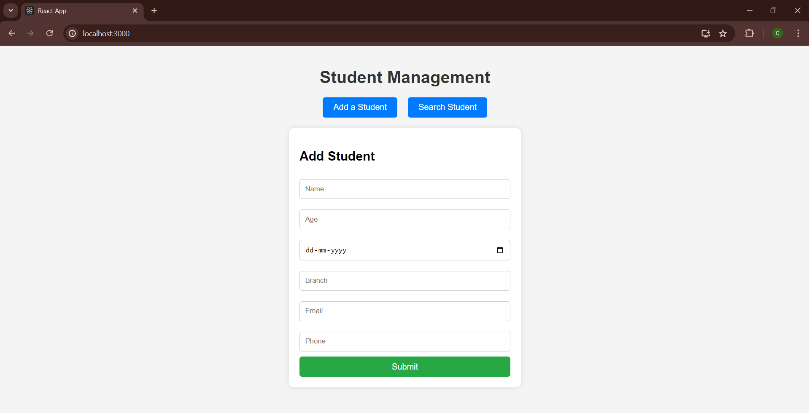
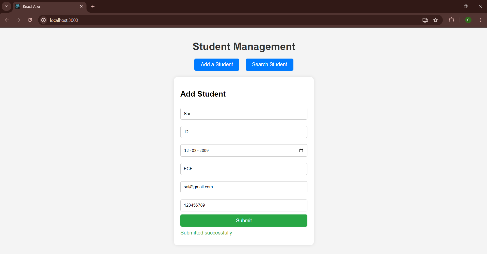
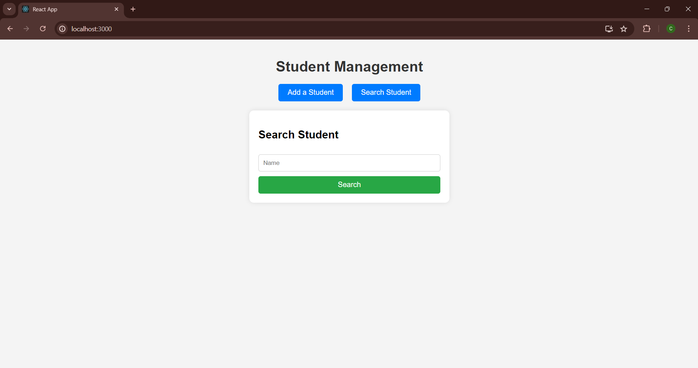
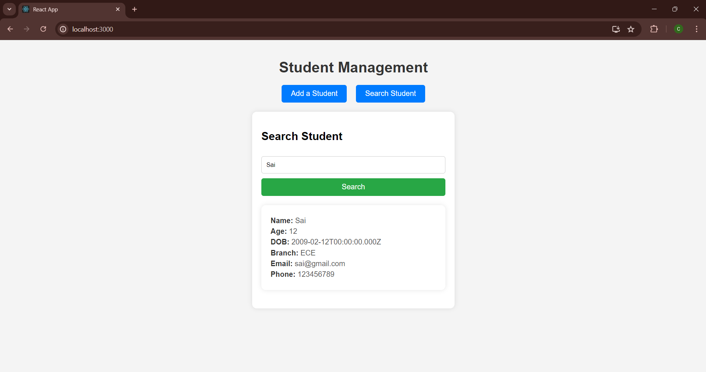

# Student Management Application

This project is a simple student management application built with Node.js for the backend and React.js for the frontend. It allows users to add student details to a MongoDB database and search for students by name.

## Features
- **Add a Student**: Enter details such as name, age, date of birth (DOB), branch, email, and phone number to add a student to the database.
- **Search Student**: Search for a student by name and view their details if found.
- **UI**: Simple and interactive UI with buttons for adding and searching students.

## Technologies Used
- **Frontend**: React.js
- **Backend**: Node.js, Express.js
- **Database**: MongoDB
- **Docker**: Containerization for backend and MongoDB
- **Environment Variables**: Used .env files to manage configuration

## Architecture



## Setup Instructions

### Prerequisites
- Node.js installed locally: You can download and install [Node.js](https://nodejs.org/en) from nodejs.org. Ensure you install the LTS (Long Term Support) version unless you have specific reasons for choosing otherwise.
- Docker installed locally (optional, for running MongoDB in a container): Docker installation guides are available for various operating systems:
- Docker Desktop for Mac: [Here](https://docs.docker.com/desktop/install/mac-install/)
- Docker Desktop for Windows:[Here](https://docs.docker.com/desktop/install/windows-install/) 
- Docker Engine for Linux: [Here](https://docs.docker.com/desktop/install/linux-install/)

### Getting Started

1. Clone the repository:
    ```bash
    git clone https://github.com/GadagojuShiva/fullstack_student_management_application.git
    cd student-management
    ```

2. Install dependencies:
    ```bash
    # Install backend dependencies
    cd backend
    npm install

    # Install frontend dependencies
    cd ../frontend
    npm install
    ```

3. Set up environment variables:
   - Rename `.env.sample` to `.env` in the `backend` directory.
   - Configure your MongoDB URI in the `.env` file:
    ```env
    MONGO_URI=
    PORT=5000
    ```

5. Run the application:

    **Option 1: Using Docker (recommended for MongoDB):**
    ```bash
    docker-compose up --build
    ```
    This command will build the Docker images and start the containers for the backend and MongoDB.

    **Option 2: Run backend and frontend separately:**
    ```bash
    # In the backend directory
    npm start

    # In the frontend directory
    npm start
    ```

6. Access the application:
    - Open your browser and navigate to [http://localhost:3000](http://localhost:3000) to view the application.
    
7. GitHub Actions and Docker Compose-2
    - GitHub Actions: Added GitHub Actions workflow (`build.yml`) for automated builds and pushes of Docker images to GitHub Packages.
    - docker-compose-2.yml: Added a new Docker Compose file (`docker-compose-2.yml`) that utilizes Docker images from GitHub Packages for local deployments.
    - To use this `docker-compose -f docker-compose-2.yml up`.
    - **NOTE**: Before you execute make sure you configure .env file to connect to db.

## Here are Some Snapshots of the application







## Usage
- Click on **Add a Student** to fill out the student details form and submit.
- Click on **Search Student** to search for a student by name.
